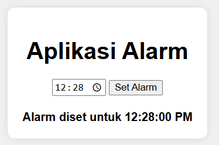
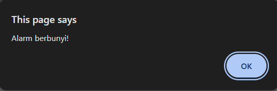

#Web Alarm JavaScript

A simple web-based alarm application built using JavaScript. This project allows users to set a specific time, and the system will trigger an alert when the time is reached.

##Features

- Set alarm time easily using time input
- Real-time clock display
- Alert notification when alarm rings
- Simple and clean user interface
- Runs directly in the browser (no installation required)

##Tech Stack

- HTML
- CSS
- JavaScript (Vanilla JS)

##Purpose

This project was created as part of my early learning journey in web development to understand:

- JavaScript time handling
- DOM manipulation
- Event handling
- Building interactive web applications

##How to Run

1. Download or clone this repository
2. Open the project folder
3. Run the file
4. Set your desired alarm time
5. Wait until the alarm triggers

##Screenshots

### Main Interface

### Alarm Notification

### Alert Popup

##What I Learned

- Working with JavaScript Date and Time
- Handling user input
- Creating simple notification logic
- Structuring a basic web project

##Future Improvements

- Add sound notification
- Add multiple alarms
- Improve UI/UX design
- Add snooze feature

##Author

Agung Wahidin Saputra  
Software Engineering Student | Aspiring AI & Developer
